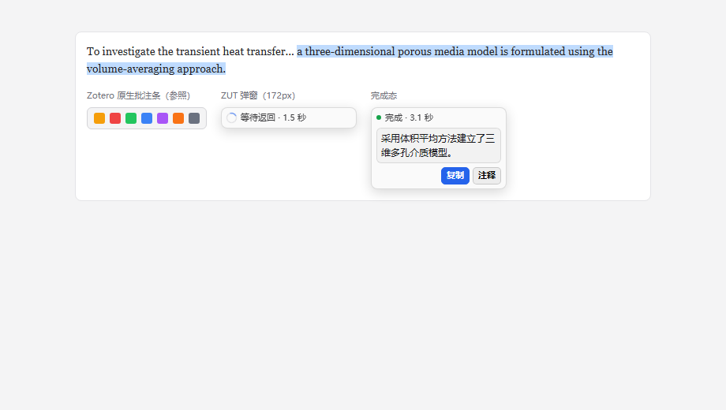

# Zotero Unified Translator（ZUT）

<p>
  
  
  
</p>

面向 **Zotero 10** 的 PDF 翻译插件。在 PDF 阅读器里选中文字即时出译文，也可以把整篇 PDF 交给自带的后端生成**双语**或**仅译文** PDF。

A Zotero 10 plugin for PDF translation: instant selection translation in the PDF reader, plus full-document (bilingual / translated-only) PDF generation through the bundled backend.



> 上图为选区翻译弹窗的版式示意（左侧为 Zotero 原生批注栏，右侧为 ZUT 弹窗的等待态与完成态）。

---

## 特性

| 能力 | 说明 |
|---|---|
| 划词即时翻译 | 在 PDF 阅读器中拖选文字，弹窗内直接显示译文 |
| 复制译文 | 一键把译文复制到剪贴板 |
| 保存为注释 | 把译文写入当前 PDF 的选区注释；已有可编辑注释会追加内容并保留原评论 |
| 整篇 PDF 翻译 | 通过独立后端生成双语 PDF 或仅译文 PDF，作为**新附件**导入，不覆盖原文件 |
| 多入口触发 | 文献列表右键 `ZUT → ZUT: 翻译 PDF`；PDF 阅读器右键「翻译整篇 PDF」 |
| 双接口检查 | 一次并行检测「即时翻译接口」与「整篇 PDF 后端」，分别给出结果 |
| 多目标语言 | 简体中文、繁体中文、英语、日语、韩语、德语、法语、西班牙语 |
| 进度反馈 | 整篇翻译期间显示读取 / 上传 / 排队 / 翻译 / 下载 / 导入进度 |
| 凭据保护 | API Key 与后端 Token 存入 Zotero 登录凭据管理器，不写进普通偏好设置 |
| 结果缓存 | 相同服务 + 模型 + 目标语言 + 原文在内存中缓存 5 分钟（不落盘，重启即清空） |

两类翻译走**两套互不相干的配置**：即时翻译负责短文本请求；整篇 PDF 由后端负责上传、排队、解析排版与结果下载。

---

## 快速开始（只用划词翻译）

不需要 Python、不需要 Docker、不需要部署任何东西。

1. 打开 Zotero 10。
2. 进入「工具 → 插件」，点齿轮 →「从文件安装插件」。
3. 选择 `release/zotero-unified-translator.xpi`，按提示重启 Zotero。
4. 打开「编辑 → 设置」，在左侧找到 **Zotero Unified Translator**。
5. 填入翻译服务的 API Key，点「保存设置」，再点「测试即时翻译」确认服务可用。
6. 打开一篇**带文本层**的 PDF，拖选一句话，在弹窗里查看译文。

> XPI 就是 Zotero 的插件安装包，没有单独的 EXE 安装程序。也可以直接从 [Releases](https://github.com/Luociqvq/zotero-unified-translator/releases) 下载 `zotero-unified-translator.xpi`。

### 即时翻译服务

插件内置两个即时翻译选项：

| 服务 | 说明 |
|---|---|
| `HY-MT1.5-1.8B 翻译接口（OpenAI 兼容）` | **默认**。走 Chat Completions 协议，需要 Bearer API Key |
| `Google Translate（免 Key）` | 不需要 API Key，属于尽力而为的免费通道，稳定性不作保证 |

默认 OpenAI 兼容配置：

| 字段 | 默认值 |
|---|---|
| 翻译接口地址 | `https://fanyi.eieu.cn/v1` |
| 模型名称 | `HY-MT1.5-1.8B` |
| 默认目标语言 | 简体中文 |

实际请求地址是「接口地址」后追加 `/chat/completions`。改用其他 OpenAI 兼容服务时，把地址换成该服务的基础地址（一般包含 `/v1`），模型名填实际模型 ID 即可。

如果服务方只接受 `hy-1.8b` 这类别名，把「模型名称」改成对应的别名即可。

**长度上限**：Google Translate 单次选区约 4500 字符；OpenAI 兼容服务约 12000 字符。超长文本请缩短选区或改用整篇翻译。

**密钥行为**：保存后当前设置页会保留输入框内容，避免误以为保存失败；重新打开设置页出于安全不回显密钥。留空再次保存会**保留原密钥**，只有点「清除」才会删除凭据。

---

## 整篇 PDF 翻译

整篇翻译使用本仓库的独立 `server/` 服务，**不是**即时翻译接口。插件只做上传、轮询、下载、导入；PDF 解析、排版与整篇翻译全部在后端完成。

后端内部的 PDF 处理引擎默认为 **`pdf2zh-next 2.9.0`**，它是 Python 服务端依赖，不是 Zotero 插件。后端调用 LLM 所需的地址 / 模型 / Key 由独立的 `ZUT_LLM_*` 变量管理，**不会**复用插件的即时翻译 Key。

### 方式一：服务器 Docker 部署（推荐）

在服务器上复制本仓库，创建自己的 `.env`（**不要把真实密钥提交进仓库**）：

```bash
cp .env.example .env
```

至少填写：

```dotenv
ZUT_AUTH_TOKEN=一个较长的后端访问口令
ZUT_LLM_ENDPOINT=https://你的整篇翻译模型服务/v1
ZUT_LLM_MODEL=你的整篇翻译模型
ZUT_LLM_API_KEY=你的整篇翻译模型密钥
```

启动 API 与 Worker：

```bash
docker compose up -d --build
docker compose logs -f
```

默认 API 只绑定服务器本机 `127.0.0.1:8890`。远程使用时推荐用 Nginx / Caddy 把 HTTPS 域名反代到该端口，并配置上传大小限制与访问认证——**不要**把未加密的后端直接暴露到公网。

### 方式二：本机部署

只在不使用远程后端时需要。前置条件：Python 3.12（64 位）。

```powershell
powershell.exe -NoProfile -ExecutionPolicy Bypass -File .\scripts\setup-backend.ps1
powershell.exe -NoProfile -ExecutionPolicy Bypass -File .\scripts\start-backend.ps1
```

`setup-backend.ps1` 会检查 Python 版本、创建 `server/.venv` 并安装依赖；失败即中止，不会把失败当成安装完成。

`start-backend.ps1` 会提示输入 Backend token 和 LLM API Key。这两个值默认只传给本次进程，不写入文件；高级用户也可通过进程环境变量提供，或用 `-EnvFile` 指定自管配置文件。端口占用会明确报错。

停止：

```powershell
powershell.exe -NoProfile -ExecutionPolicy Bypass -File .\scripts\stop-backend.ps1
```

日志位于 `data/zut-api.log`、`data/zut-api.log.error`、`data/zut-worker.log`、`data/zut-worker.log.error`。**不要公开**包含第三方响应或论文信息的原始日志。

### 在 Zotero 中连接后端

在 ZUT 设置页的「整篇 PDF 翻译」区域填写：

| 设置 | 内容 |
|---|---|
| 整篇翻译后端地址 | 远程填 `https://pdf.example.com`；本机填 `http://127.0.0.1:8890` |
| 后端 Bearer Token | 与服务器 `.env` 中的 `ZUT_AUTH_TOKEN` 一致 |
| PDF 引擎 | `pdf2zh-next 2.9.0` |
| 输出模式 | 双语 PDF 或仅译文 PDF |

点「保存设置」，再点「检查两个接口」验证连通性。这是**并行**执行两项检查：一项真实即时翻译请求（校验 Key 与模型），一项后端 `/api/v1/health`（校验服务状态与引擎）。每项最多等 15 秒，互不阻塞。

### 发起整篇翻译

1. 选一篇较短、可选中文字的 PDF 试手。
2. 文献列表中选中**单个**条目或 PDF 附件 → 右键 `ZUT → ZUT: 翻译 PDF`；或在 PDF 阅读器页面 / 选中文字上右键「翻译整篇 PDF」。
3. 等待上传与翻译进度，完成后会自动添加**一个新的 PDF 附件**。
4. 打开译文，检查文字、公式与版式。

译文标题包含原文件名、语言、输出模式、引擎与源文件哈希片段，避免同名不同内容的 PDF 被误判。父条目下相同译文标题会阻止重复导入；独立附件没有这项客户端去重。

> 当前一次只提交一篇，且没有插件内任务历史页。请保持 Zotero 打开直到下载完成，重启后不会自动接续未完成的下载。目标语言沿用设置中的「默认目标语言」。

---

## 常见问题

| 现象 | 处理 |
|---|---|
| 提示不兼容 / 无法安装 | 确认装的是本仓库 release 中的 1.0.1 包；关掉旧安装对话框后重新选择 XPI；老版本（≤1.0.0）请手动安装 1.0.1 一次 |
| 设置里找不到插件入口 | 到「编辑 → 设置」**左侧列表**找插件名；确认插件已启用，必要时重启 |
| 划词翻译失败 | 检查接口地址（是否含 `/v1`）、模型名与 API Key；点「测试即时翻译」看具体错误 |
| 提示 `valid Bearer API key is required` | 接口已连通但没填有效 Key，在设置页填好并保存 |
| 双接口检查失败 | 分别看即时翻译项与整篇 PDF 项的错误；整篇后端还要核对端口与 `data/` 日志 |
| 上传返回 401 | 插件里的 Token 必须与后端 `ZUT_AUTH_TOKEN` 完全一致 |
| 任务一直排队 | 确认 Worker 进程没退出——API 在线不代表 Worker 在线 |
| `ENGINE_UNAVAILABLE` | 检查后端依赖版本、LLM Key / 地址 / 模型配置 |
| `ENGINE_FAILED` | 检查模型权限、网络、字体 / 模型资源与 PDF 本身，换短文献重试 |
| 译文与原文相同 | 确认没有启用 mock 引擎；mock 只复制文件，不翻译 |
| 双栏 / 公式 / 表格版式不理想 | 引擎无法保证所有 PDF 完美保留版式，需人工检查实际结果 |

---

## 数据与隐私

- 选区文本会发送给所选的即时翻译服务。
- 整篇 PDF 会发送给所配置的后端；PDF 引擎再把翻译所需文本发送给其 LLM 服务。
- 插件凭据保存在 Zotero 登录凭据管理器；后端 Key 由环境变量提供。本机 `.env` 是用户自管的明文配置，**不是**加密存储。
- 插件**没有**自动同步密钥或遥测功能。
- LLM 服务可能按量计费，费用计入你自己的账号。
- 任务源文件与输出保存在 `ZUT_DATA_DIR`，默认在任务创建 7 天后具备清理资格。当前不会自动定时清理，可按需执行：

```powershell
$env:PYTHONPATH = "$PWD\server"
$env:ZUT_DATA_DIR = "$PWD\data"
server\.venv\Scripts\python.exe -m zut_server.cleanup
```

清理会删除已过期的终态任务及其后端文件，**无法通过后端恢复**；已导入 Zotero 的附件不受影响。

---

## 项目结构

```
plugin/       Zotero 插件源码、资源、构建与回归测试（TypeScript + esbuild）
server/       ZUT 后端：API、SQLite、Worker、引擎适配器（Python / FastAPI）
scripts/      Windows 下的安装、启动、停止、打包脚本，以及更新清单校验
docs/         API 契约、部署说明、功能说明、验收清单与记录、发版流程
release/      供安装的 XPI 产物
updates.json  Zotero 读取的自动更新清单
```

文档入口见下方 [文档](#文档) 一节。

---

## 开发与构建

### 插件

```powershell
Set-Location plugin
npm ci
npm run build     # 类型检查 + 打包
npm test          # 回归测试
```

构建产物为 `plugin/.scaffold/build/zotero-unified-translator.xpi`。

在仓库根目录执行以下命令可一次性构建、验证并复制到 `release/`：

```powershell
powershell.exe -NoProfile -ExecutionPolicy Bypass -File .\scripts\package-plugin.ps1
```

> Zotero 10 要求清单里必须存在 `applications.zotero.update_url`，且**只有该字段指向真实清单地址时才会检查更新**。
> 本仓库构建出的包默认指向 `updates.json` 的线上地址（`ZUT_UPDATE_URL` 环境变量可覆盖）。仓库根目录的 `updates.json` 是给 Zotero 读的更新清单，改版本后必须同步更新，否则自动更新会静默失效 —— `scripts/package-plugin.ps1` 末尾会自动调用 `scripts/verify-updates.mjs` 拦截这类不一致。
> 完整的发版流程见 [发版与自动更新维护](docs/release.md)。

### 后端

```powershell
powershell.exe -NoProfile -ExecutionPolicy Bypass -File .\scripts\setup-backend.ps1 -Dev
Set-Location server
.venv\Scripts\python.exe -m pytest
```

自动化测试使用模拟服务，**不会**调用真实收费翻译接口。

---

## 版本与兼容性

- 当前版本：**1.0.1**
- 宿主声明：最低 `10.0.0`，最高 `10.0.*`（这不是对 10.1 或未来版本的兼容承诺）
- 已针对 Zotero **10.0.1** 做隔离档案下的清单识别与兼容性判定，插件启动注册由自动化回归测试覆盖
- PDF 阅读器的人工交互与真实 LLM 翻译质量仍需你在本机实测，详见 [验收记录](docs/verification.md) 与 [人工验收清单](docs/acceptance-checklist.md)

### 升级

**1.0.1 起已接入自动更新。** Zotero 会通过仓库根目录的 [`updates.json`](updates.json) 检查新版本并自动升级；在「工具 → 插件」齿轮菜单里也能手动触发「检查更新」。

> ⚠️ **如果你装的是 1.0.0 或更早版本，不会收到自动更新提示** —— 那些版本的清单里填的是占位地址。请手动安装一次 1.0.1，之后自动更新才会生效。

**尚未实现**：批量翻译界面、逐句连续翻译、多服务并排对比、标题摘要翻译、OCR、快捷键配置、插件内任务历史 / 取消按钮、多用户后端。

---

## 文档

| 文档 | 内容 |
|---|---|
| [功能说明](docs/ZUT功能说明.md) | 每个功能的详细行为与限制 |
| [部署说明](docs/deployment.md) | 后端部署细节 |
| [API 契约](docs/api-v1.md) | 后端 HTTP 接口 |
| [人工验收清单](docs/acceptance-checklist.md) | 可勾选的本机验收步骤 |
| [验收记录](docs/verification.md) | 各版本验证结论与产物校验值 |
| [发版与自动更新维护](docs/release.md) | 发布流程与更新清单维护 |
| [第三方依赖与许可证](THIRD-PARTY.md) | 逐项依赖许可清单 |
| [NOTICE](NOTICE) | 第三方组件与参考项目声明 |

---

## 许可证

本项目以 **AGPL-3.0-or-later** 授权，全文见 [LICENSE](LICENSE)。

后端依赖中包含 AGPL-3.0 组件（`pdf2zh-next`、`babeldoc`、`PyMuPDF`）。**若打算闭源或商业托管后端，请先阅读 [THIRD-PARTY.md](THIRD-PARTY.md) 第 4 节** —— AGPL 第 13 条会要求你向网络服务使用者提供源码，PyMuPDF 闭源商用还需购买 Artifex 商业许可。

作者：Luoci
